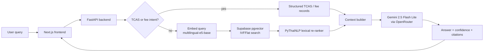

<div align="center">
  <strong>KUru: Intelligent PLO-to-Career Navigator</strong>
  <br />
  A bilingual AI advisor that connects Thai M6 students to KU programs through natural language chat, RIASEC personality matching, and cited curriculum answers.
  <br />
  <br />
  
  
  
  
  
  <br />
  <br />
  01219462 — Software Engineering for AI-Enabled System | Kasetsart University | 2025
</div>

## AI-Enabled Class Grader Note

For the 01219462 AI-Enabled System POC submission, start with the dedicated grader guide: [pipeline/docs/POC_GRADER_GUIDE.md](pipeline/docs/POC_GRADER_GUIDE.md). It maps the class deliverables directly to Part A, B1-B7, Part C, MLflow screenshots, notebooks, and the B7 API endpoint.

## Table of Contents

- [AI-Enabled Class Grader Note](#ai-enabled-class-grader-note)
- [Project Overview](#project-overview)
- [System Architecture](#system-architecture)
- [Repository Structure](#repository-structure)
- [Deliverables Index (for grader)](#deliverables-index-for-grader)
- [Prerequisites](#prerequisites)
- [Environment Variables](#environment-variables)
- [Local Setup — Step by Step](#local-setup--step-by-step)
- [Running the Notebooks](#running-the-notebooks)
- [MLflow Experiment Tracking](#mlflow-experiment-tracking)
- [API Reference](#api-reference)
- [Dataset](#dataset)
- [Team & Role Assignment](#team--role-assignment)
- [AI Usage Disclosure](#ai-usage-disclosure)
- [License](#license)

## Project Overview

KUru helps Thai M6 students explore Kasetsart University programs without reading dozens of formal มคอ.2 curriculum PDFs or manually cross-checking TCAS admission documents. The source data is public, but it is scattered across long Thai PDFs, scanned pages, TCAS PDFs/XLSX files, and faculty-specific formats.

The system combines a RAG chatbot, a RIASEC-based recommendation experience, a program explorer, and TCAS round-aware lookup. Students can ask curriculum, PLO, course, fee, and admission questions in Thai or English, then receive an answer with confidence and source citations.

The core AI path uses `intfloat/multilingual-e5-base` as the local Thai-English retriever and `google/gemini-2.5-flash-lite` through OpenRouter as the answer generator. The selected production behavior is the v8 structured RAG pipeline: v7 targeted lexical reranking plus TCAS relinking, structured fee grounding, and Thai/English response policy fixes.

## System Architecture



| Component | Technology | Hosting |
|---|---|---|
| Frontend | Next.js App Router, React 19, TypeScript | Vercel |
| Backend API | FastAPI, Python 3.12-compatible, Uvicorn | Railway |
| Embedding model | `intfloat/multilingual-e5-base` (~1.1 GB, 768 dim) | Local backend/pipeline runtime |
| Vector store | Supabase pgvector, IVFFlat, 13,910 current chunks | Supabase |
| LLM generator | `google/gemini-2.5-flash-lite` | Google via OpenRouter |
| Experiment tracking | MLflow 3.x / 2.x-compatible local store | Local SQLite at `pipeline/mlflow.db` |

## Repository Structure

```text
kuru/
├── README.md                         # Production project README
├── requirements.txt                  # Grader-friendly combined Python dependency summary
├── LICENSE                           # MIT license
├── ONBOARDING.md                     # Team onboarding notes
├── specs/                            # Product, architecture, and task planning context
│   ├── context/                      # Domain and architecture references
│   ├── plan/                         # Backend/Supabase planning notes
│   ├── summary/                      # Implementation progress summaries
│   └── tasks/                        # Frontend and MVP task breakdowns
├── backend/                          # FastAPI service for B7 model deployment and program APIs
│   ├── main.py                       # FastAPI app, CORS, router registration, health endpoint
│   ├── pyproject.toml                # Backend uv project; requires Python >=3.12
│   ├── requirements.txt              # Backend dependency export for graders
│   ├── .env.example                  # Backend environment variable template
│   ├── api/v1/chat.py                # POST /chat and POST /chat/feedback
│   ├── api/v1/programs.py            # Program search/detail API backed by Supabase
│   ├── api/v1/router.py              # Versioned API router
│   ├── core/config.py                # Pydantic settings and CORS parsing
│   ├── core/supabase.py              # Cached Supabase client factory
│   ├── models/schemas.py             # Pydantic request/response schemas
│   ├── migrations/                   # Backend feedback/program metadata SQL migrations
│   └── mlartifacts/                  # B7 deployable RAG model metadata
│       ├── MLmodel                   # MLflow-style model artifact descriptor
│       └── pipeline_config.json      # Selected v8 RAG pipeline configuration
├── frontend/                         # Next.js UI for chat, RIASEC, explorer, and portfolio flows
│   ├── package.json                  # Next.js scripts and npm dependencies
│   ├── next.config.mjs               # Next.js config and next-intl plugin
│   ├── .env.example                  # Frontend runtime config template
│   ├── src/app/                      # App Router pages: landing, chat, explore, RIASEC, portfolio
│   ├── src/components/chat/          # Chat bubbles, source citations, feedback buttons
│   ├── src/components/explore/       # Program explorer cards and TCAS round UI
│   ├── src/lib/api/                  # Typed real/mock API clients and Zod schemas
│   ├── src/lib/store.ts              # Zustand state for chat and RIASEC
│   ├── src/messages/                 # Thai and English UI messages
│   └── e2e/                          # Playwright route/navigation tests
└── pipeline/                         # Data ingestion, RAG engine, notebooks, and MLflow evidence
    ├── pyproject.toml                # Pipeline uv project; requires Python >=3.11
    ├── requirements.txt              # Pipeline dependency export for graders
    ├── .env.example                  # Pipeline API/database variable template
    ├── mlflow.db                     # B4 MLflow SQLite tracking store
    ├── db/schema.sql                 # Supabase schema for programs/chunks/TCAS
    ├── src/kuru/ingestion/           # PDF extraction, OCR, chunking, embeddings, structured extraction
    ├── src/kuru/rag/query_engine.py  # RAG retrieval, reranking, TCAS/fee branching, generation
    ├── src/kuru/scripts/             # CLI commands: download, setup-db, ingest, coverage, demo
    ├── scripts/                      # Eval, cleanup, backfill, audit, and MLflow utility scripts
    ├── data/                         # Eval CSVs, result CSVs, B6 saved cases, mapping files
    ├── notebooks/                    # B1, B2, B5, B6, B7 Jupyter deliverables
    ├── docs/                         # POC reports, rubric mapping, interface docs, ingestion state
    ├── docs/figures/                 # B1/B2/B3 generated charts
    └── screenshots/mlflow/           # B4 MLflow screenshots
```

## Deliverables Index (for grader)

| Deliverable | Manuscript Requirement | Location in Repo |
|---|---|---|
| Project Report | PDF — Part A & B | Source markdown: `pipeline/docs/Part_A_report.md`, `pipeline/docs/Part_B_alignment.md`; final PDF submitted via Google Classroom |
| Jupyter Notebooks | `.ipynb` — Parts B1–B7 | `pipeline/notebooks/B1_data_exploration.ipynb`, `pipeline/notebooks/B2_model_training.ipynb`, `pipeline/notebooks/B5_explainability.ipynb`, `pipeline/notebooks/B6_prediction_reasoning.ipynb`, `pipeline/notebooks/B7_model_deployment.ipynb` |
| MLflow Screenshots | PNG/JPG — Task B-4 | `pipeline/screenshots/mlflow/` and `pipeline/docs/B4_MLflow_Run_and_Screenshots.md` |
| Model Artifact | `MLmodel` + `pipeline_config.json` | `backend/mlartifacts/` |
| Dataset | CSV/ZIP/URL | Eval data in `pipeline/data/`; source Drive: `https://drive.google.com/drive/folders/1zmvMNmCYyzxLHjJWfHfqH0Yzoa6ZDYWC` |
| Source Code | GitHub repository | This repo: `https://github.com/GanTaroLnwza007/kuru` |
| `requirements.txt` | Python dependencies | `requirements.txt`, `backend/requirements.txt`, `pipeline/requirements.txt` |
| Video Presentation | Demo + UI-Model testing | Submitted via Google Classroom |
| Slide Presentation | PDF — key features | Submitted via Google Classroom |
| POC Grader Guide | Fast map for the AI-Enabled class | `pipeline/docs/POC_GRADER_GUIDE.md` |

## Prerequisites

- Git 2.x
- Python 3.12+ for `backend/` (`backend/pyproject.toml`)
- Python 3.11+ for `pipeline/` (`pipeline/pyproject.toml` and `backend/mlartifacts/MLmodel`)
- `uv` for Python environment management
- Node.js 20+ and npm for the Next.js 16 frontend
- Supabase project with pgvector schema applied
- Optional: Neo4j Aura credentials if running graph setup

No Dockerfile or docker-compose file is present in this repository.

## Environment Variables

| Variable | Required | Description | Where to get it |
|---|---|---|---|
| `SUPABASE_URL` | Yes | Supabase project URL used by backend and pipeline | Supabase dashboard → Settings → API |
| `SUPABASE_KEY` | Yes | Supabase anon or service key used by backend and pipeline | Supabase dashboard → Settings → API |
| `SUPABASE_SERVICE_ROLE_KEY` | Optional | Backend setting available for privileged Supabase operations | Supabase dashboard → Settings → API |
| `DATABASE_URL` | Required for schema setup/VACUUM | Direct PostgreSQL URL used by `kuru-setup-db` and post-ingest `VACUUM ANALYZE` | Supabase dashboard → Database |
| `OPENROUTER_API_KEY` | Yes for RAG answers/eval | OpenRouter key for Gemini generation and optional OCR routing | openrouter.ai → Keys |
| `GEMINI_API_KEY` | Yes for structured extraction | Google Gemini key for structured extraction and explicit full-PDF OCR runs | Google AI Studio |
| `TYPHOON_API_KEY` | Optional but recommended for scanned PDFs | Typhoon OCR key for low-yield scanned/image pages during normal ingestion | Typhoon/OpenTyphoon console |
| `OCR_MODEL` | Optional | Full-PDF OCR model used only by the isolated/manual scanned-PDF OCR path | Set in `.env` if changing OCR route |
| `GENERATION_MODEL` | Optional | RAG answer model; default is `google/gemini-2.5-flash-lite` | OpenRouter model ID |
| `LLM_MODEL` | Optional | Gemini text model for structured extraction; default is `gemini-2.5-flash-lite` | Google model ID |
| `NEO4J_URI` | Optional | Neo4j database URI for graph setup | Neo4j Aura |
| `NEO4J_USERNAME` | Optional | Neo4j username | Neo4j Aura |
| `NEO4J_PASSWORD` | Optional | Neo4j password | Neo4j Aura |
| `REDIS_URL` | Optional | Reserved backend setting for Redis/Celery | Local/hosted Redis |
| `CORS_ORIGINS` | Optional | Comma-separated allowed frontend origins; default `http://localhost:3000` | Local config |
| `NEXT_PUBLIC_API_BASE_URL` | Yes unless mock mode | Frontend API base URL, usually `http://localhost:8000/api/v1` | Local backend URL |
| `NEXT_PUBLIC_USE_MOCK` | Optional | `true` to use mock frontend data | Local frontend config |
| `NEXT_PUBLIC_USE_MOCK_CHAT` | Optional | `true` to mock chat only | Local frontend config |

## Local Setup — Step by Step

### 9.1 Clone and install

```bash
git clone https://github.com/GanTaroLnwza007/kuru.git
cd kuru
```

```bash
cd pipeline
uv sync
cd ../backend
uv sync
uv pip install -e ../pipeline
cd ../frontend
npm install
```

### 9.2 Configure environment variables

```powershell
cd kuru
Copy-Item backend\.env.example backend\.env
Copy-Item pipeline\.env.example pipeline\.env
Copy-Item frontend\.env.example frontend\.env.local
```

Edit the three files and fill the variables listed above. For frontend local development, use:

```env
NEXT_PUBLIC_API_BASE_URL=http://localhost:8000/api/v1
NEXT_PUBLIC_USE_MOCK=false
NEXT_PUBLIC_USE_MOCK_CHAT=false
```

### 9.3 Start the backend (FastAPI)

```bash
cd backend
uv run uvicorn main:app --reload
```

The API runs at `http://localhost:8000`, with v1 routes under `http://localhost:8000/api/v1`.

### 9.4 Run the ingestion pipeline (if applicable)

Use this only when rebuilding the Supabase corpus. The current POC already uses an existing Supabase database.

```powershell
cd pipeline
uv run kuru-download --sync
uv run kuru-download --tcas-only
uv run kuru-setup-db
uv run kuru-ingest-mko บางเขน
uv run kuru-ingest-tcas
```

Useful repair/evaluation commands after source refresh:

```powershell
cd pipeline
uv run python scripts/cleanup_program_duplicates.py
uv run python scripts/backfill_program_metadata.py
uv run python scripts/backfill_program_fees.py
uv run python scripts/relink_tcas_program_ids.py
```

### 9.5 Start the frontend (Next.js)

```bash
cd frontend
npm run dev
```

Open `http://localhost:3000`.

### 9.6 Verify — health check command

```bash
curl http://localhost:8000/api/v1/health
```

Expected response:

```json
{"status":"ok"}
```

You can also run the API integration smoke tests:

```bash
cd pipeline
uv run python scripts/test_api.py
```

## Running the Notebooks

Launch Jupyter from the pipeline environment:

```bash
cd pipeline
uv run jupyter notebook notebooks
```

| Notebook | Demonstrates | Prerequisite |
|---|---|---|
| `pipeline/notebooks/B1_data_exploration.ipynb` | Corpus exploration, section distribution, chunk coverage, B1 figures | Supabase env variables |
| `pipeline/notebooks/B2_model_training.ipynb` | RAG-as-model training loop, retrieval configs, LLM-as-judge eval, MLflow logging, B3/B5 sections | Supabase + OpenRouter env variables |
| `pipeline/notebooks/B5_explainability.ipynb` | Standalone B5 wrapper explaining retrieval evidence, confidence, and source attribution | Saved figures/results |
| `pipeline/notebooks/B6_prediction_reasoning.ipynb` | Three prediction traces with query flags, retrieval funnel, citations, and non-technical reasoning | Backend/RAG optional; falls back to `pipeline/data/b6_case*.json` |
| `pipeline/notebooks/B7_model_deployment.ipynb` | REST API deployment evidence, request/response schemas, three live validation scenarios | Backend running at `http://localhost:8000/api/v1` |

## MLflow Experiment Tracking

The MLflow SQLite store is:

```text
pipeline/mlflow.db
```

Open the UI from `pipeline/`:

```bash
uv run mlflow ui --backend-store-uri sqlite:///mlflow.db --port 5000
```

Then visit `http://localhost:5000`.

Experiment name:

```text
kuru-rag-hyperparameter-search
```

The original B2 comparison includes `baseline` (`top_k=5`, `min_similarity=0.35`), `wider_retrieval` (`top_k=8`, `min_similarity=0.30`), and `strict_threshold` (`top_k=5`, `min_similarity=0.45`). The selected production model is `v8_structured_tcas_fees`, not the older `wider_retrieval` run, because v8 includes the real frontend regressions: TCAS relinking, structured fee grounding, targeted lexical reranking, and Thai/English response behavior. Its MLflow run id is `8a47e44b6c034bbcb83f697ecfdfe603`.

Current headline metrics:

| Run | Purpose | Result |
|---|---|---|
| `latest_submission_headline_v7_rerank_74pct` | Headline retrieval benchmark | 74% good, 2.26 / 3.0 |
| `v8_structured_tcas_fees` | Selected production regression suite | 72.7% good, 2.055 / 3.0 |
| `v7_filtered_rerank_stress` | Harder course-table-heavy stress set | 62% good, 1.92 / 3.0 |

## API Reference

#### POST /api/v1/chat

Request schema:

```json
{
  "message": "string",
  "program_context_id": "string or null",
  "session_id": "string or null",
  "conversation_history": [
    {
      "role": "user or assistant",
      "content": "string"
    }
  ]
}
```

Response schema:

```json
{
  "data": {
    "answer": "string",
    "session_id": "string",
    "confidence_level": "high | medium | low",
    "sources": [
      {
        "source_file": "string",
        "section_type": "string",
        "similarity": 0.0
      }
    ],
    "used_tcas_data": false
  },
  "sources": [],
  "error": null
}
```

Scenario 1: curriculum query (English)

```bash
curl -X POST http://localhost:8000/api/v1/chat \
  -H "Content-Type: application/json" \
  -d "{\"message\":\"What courses will I take in Computer Engineering?\",\"session_id\":\"b7-test-session-001\",\"conversation_history\":[]}"
```

Scenario 2: TCAS round detection query

```bash
curl -X POST http://localhost:8000/api/v1/chat \
  -H "Content-Type: application/json" \
  -d "{\"message\":\"What are the TCAS3 score requirements for Computer Engineering?\",\"session_id\":\"b7-test-session-002\",\"conversation_history\":[]}"
```

Scenario 3: Thai PLO query

```bash
curl -X POST http://localhost:8000/api/v1/chat \
  -H "Content-Type: application/json" \
  -d "{\"message\":\"หลักสูตรวิศวกรรมโยธา-ชลประทาน มี PLO อะไรบ้าง\",\"session_id\":\"b7-test-session-003\",\"conversation_history\":[]}"
```

#### Other endpoints

| Method | Path | Purpose |
|---|---|---|
| `GET` | `/api/v1/health` | Health check; returns `{"status":"ok"}` |
| `POST` | `/api/v1/chat/feedback` | Stores thumbs-up/down feedback for a chat answer |
| `GET` | `/api/v1/programs/search?q=&faculty=&limit=` | Searches curated programs from Supabase |
| `GET` | `/api/v1/programs/{identifier}` | Returns program detail by slug or program id, including PLOs and TCAS rounds |

## Dataset

| Item | Detail |
|---|---|
| Source | มคอ.2 (TQF2) curriculum PDFs — official KU program specifications |
| Secondary | TCAS Round 1 and Round 3 admission PDFs/XLSX spreadsheets; source files live under `pipeline/data/native/tcas/` after download |
| Current cleaned corpus | 57 Bangkhen program records and 13,910 document chunks after duplicate cleanup |
| TCAS/fees | TCAS records are linked to canonical `programs.id`; fees live in `programs.fees` as source-backed JSONB metadata |
| Access | `https://drive.google.com/drive/folders/1zmvMNmCYyzxLHjJWfHfqH0Yzoa6ZDYWC` |
| Sensitive data | None — all source material is official public KU curriculum or admission information |

## Team & Role Assignment

| Name | Student ID | Role | Responsibilities |
|---|---|---|---|
| Thanawat Tantijaroensin | 6610545294 | Data Scientist | Embedding model selection, chunking strategy, RAG pipeline design, evaluation framework |
| Phantawat Lueangsiriwattana | 6610545871 | Software Engineer | Ingestion pipeline, FastAPI backend, Supabase schema, deployment |

## AI Usage Disclosure

GitHub Copilot was used for boilerplate FastAPI endpoint definitions, pytest fixtures, and JavaScript/TypeScript component scaffolding. All generated code was reviewed and understood by the team.

Claude (Anthropic) was used to improve grammar and clarity in report writing, to generate structured documentation prompts, and to help audit the submission against the manuscript criteria. All technical content was verified against the codebase before inclusion.

Gemini 2.5 Flash Lite is used as the generator in the KUru RAG system and as the LLM-as-judge in the offline evaluation pipeline (`pipeline/scripts/run_eval.py`). This is an integral part of the system and experiment workflow.

## License

This repository is licensed under the MIT License. See `LICENSE`.
