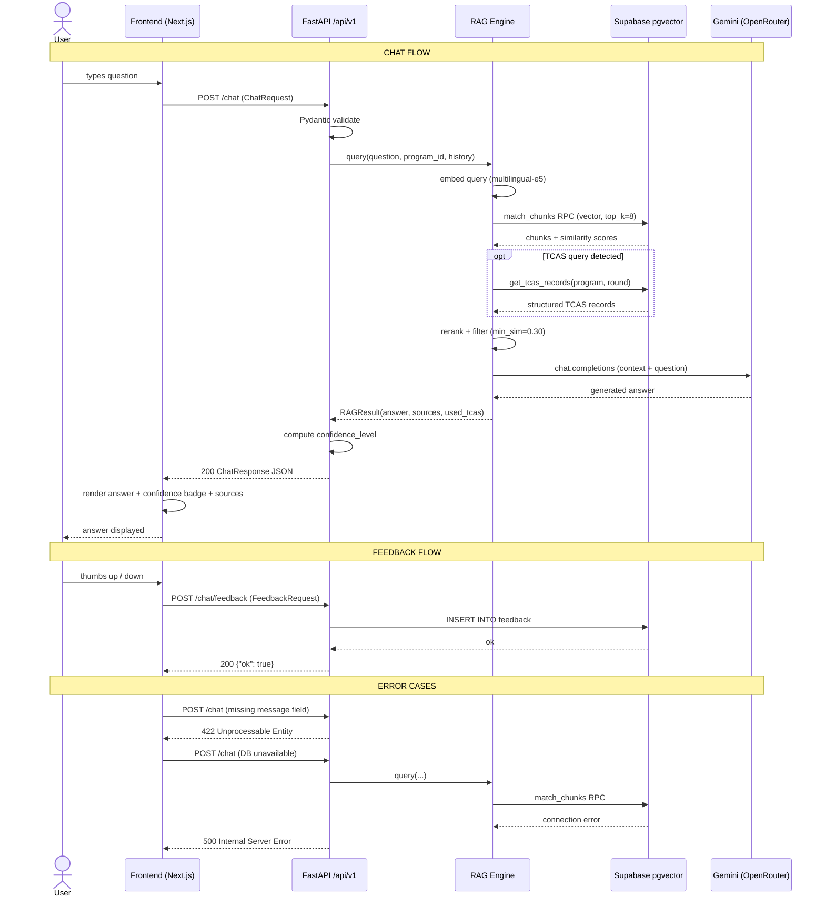

# C2 — UI-Model Interface Contract

**KUru: KU Curriculum & PLO Navigator**

This document defines the full interface contract between the Next.js frontend and the
FastAPI model service. All endpoints are prefixed with `/api/v1`.

---

## 1. Endpoints Overview

| Method | Path | Purpose |
|--------|------|---------|
| `GET` | `/api/v1/health` | Service health check |
| `GET` | `/api/v1/programs/search` | Search and list programs |
| `GET` | `/api/v1/programs/{identifier}` | Get full program detail (PLOs + TCAS) |
| `POST` | `/api/v1/chat` | Submit question to RAG pipeline |
| `POST` | `/api/v1/chat/feedback` | Submit thumbs-up/down rating |

---

## 2. Request Payload Schemas

### `POST /api/v1/chat` — `ChatRequest`

| Field | Type | Required | Description |
|-------|------|----------|-------------|
| `message` | `string` | ✅ Yes | The user's question (Thai or English) |
| `program_context_id` | `string \| null` | No | Program ID to pre-seed retrieval context (from "Chat about this program") |
| `session_id` | `string \| null` | No | UUID for multi-turn session continuity |
| `conversation_history` | `ConversationTurn[]` | No | Last ≤5 turns: `[{"role": "user"|"assistant", "content": "..."}]` |

**Example request:**
```json
{
  "message": "What are the TCAS3 score requirements for Computer Engineering?",
  "program_context_id": null,
  "session_id": "550e8400-e29b-41d4-a716-446655440000",
  "conversation_history": []
}
```

---

### `POST /api/v1/chat/feedback` — `FeedbackRequest`

| Field | Type | Required | Description |
|-------|------|----------|-------------|
| `session_id` | `string` | ✅ Yes | Session ID the answer belongs to |
| `question` | `string` | ✅ Yes | The question that was asked |
| `answer` | `string` | ✅ Yes | The answer that was given |
| `rating` | `integer` | ✅ Yes | `1` = helpful, `-1` = not helpful |

**Example request:**
```json
{
  "session_id": "550e8400-e29b-41d4-a716-446655440000",
  "question": "What courses will I take in Computer Engineering?",
  "answer": "The Computer Engineering curriculum includes...",
  "rating": 1
}
```

---

### `GET /api/v1/programs/search` — Query Parameters

| Parameter | Type | Default | Description |
|-----------|------|---------|-------------|
| `q` | `string` | `""` | Search string (matches Thai or English name) |
| `faculty` | `string \| null` | `null` | Filter by faculty name |
| `limit` | `integer` | `100` | Max results (1–200) |

---

## 3. Response Payload Schemas

### `POST /api/v1/chat` — `ChatResponse`

All successful responses are wrapped in `ApiResponse<T>`:
```json
{
  "data": { ... },
  "sources": [],
  "error": null
}
```

| Field | Type | Description |
|-------|------|-------------|
| `answer` | `string` | Grounded Thai or English answer from Gemini |
| `session_id` | `string` | UUID echoed back (auto-generated if not provided) |
| `confidence_level` | `"high" \| "medium" \| "low"` | Derived from top chunk similarity: `≥0.5` → high, `≥0.35` → medium, else low |
| `sources` | `ChatSourceChunk[]` | Retrieved chunks used as context |
| `used_tcas_data` | `boolean` | Whether structured TCAS records were injected |

**`ChatSourceChunk` fields:**

| Field | Type | Description |
|-------|------|-------------|
| `source_file` | `string` | Source PDF filename |
| `section_type` | `string` | `"course"`, `"plo"`, `"admission"`, or `"general"` |
| `similarity` | `float` | Cosine similarity score (0.0–1.0) |

**POC source-inspection boundary:** In the current UI, these fields render as citation chips so users can see where an answer came from. The chips are provenance indicators, not clickable document viewers. The API does not yet return `chunk_id`, page number, or `source_url`, so the frontend cannot deep-link to the exact PDF page or extracted chunk. Phase 2 should extend `ChatSourceChunk` with source-inspection fields before implementing clickable citations.

**Example response:**
```json
{
  "data": {
    "answer": "For TCAS Round 3, Computer Engineering requires GPAX ≥ 2.75...",
    "session_id": "550e8400-e29b-41d4-a716-446655440000",
    "confidence_level": "high",
    "sources": [
      {
        "source_file": "วิศวกรรมคอมพิวเตอร์_bangkhen_mko2.pdf",
        "section_type": "admission",
        "similarity": 0.681
      }
    ],
    "used_tcas_data": true
  },
  "sources": [],
  "error": null
}
```

---

### `GET /api/v1/programs/search` — `ProgramSearchResult`

| Field | Type | Description |
|-------|------|-------------|
| `results` | `ProgramSummary[]` | Matching programs |
| `total` | `integer` | Count of results returned |

**`ProgramSummary` fields:**

| Field | Type | Description |
|-------|------|-------------|
| `id` | `string` | Hash-based primary key (e.g. `bangkhen_ddf705a9`) |
| `slug` | `string` | URL-friendly identifier (e.g. `computer-engineering`) |
| `name_th` | `string` | Program name in Thai |
| `name_en` | `string` | Program name in English |
| `faculty_th` | `string` | Faculty name in Thai |
| `faculty_en` | `string` | Faculty name in English |
| `degree` | `string` | Degree type (e.g. `ปริญญาตรี`) |
| `campus` | `string` | Campus name |
| `match_score` | `float` | Relevance score (0.0–1.0) |
| `year_by_year_vibe` | `string` | Thai summary of year-by-year experience |

---

### `GET /api/v1/programs/{identifier}` — `ProgramDetail`

Extends `ProgramSummary` with:

| Field | Type | Description |
|-------|------|-------------|
| `plos` | `PloItem[]` | Program Learning Outcomes: `[{"code": "PLO1", "description_th": "..."}]` |
| `tcas_rounds` | `TcasRound[]` | TCAS rounds: `[{"round": "round3", "quota": 30, "min_score": 2.75}]` |

---

## 4. HTTP Error Specifications

| Status | Trigger | Response body |
|--------|---------|---------------|
| `200 OK` | Successful request | `{"data": {...}, "error": null}` |
| `404 Not Found` | `GET /programs/{id}` — program not in DB | `{"data": null, "sources": [], "error": "Program not found"}` |
| `422 Unprocessable Entity` | Missing required field (e.g. `message`) | Pydantic default: `{"detail": [{"msg": "field required", "loc": ["body", "message"], "type": "missing"}]}` |
| `500 Internal Server Error` | Supabase or OpenRouter unreachable | `{"data": null, "error": "DB connection failed"}` (or unhandled exception traceback in dev mode) |

---

## 5. Sequence Diagram

See rendered diagram in conversation (or reproduce with the Mermaid source below).


